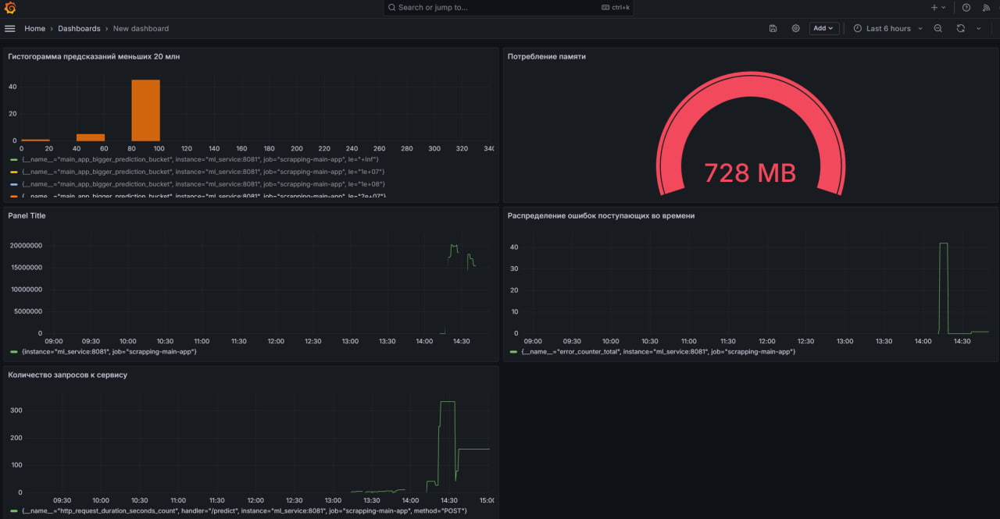

# Мониторинг
Здесь опишу метрики используемые для мониторинга работы ml модели в реальном времени

## Для мониторинга выбраны метрики нескольких направлений:


### Инфраструктурный уровень 
Инфраструктурные метрики:

- Насыщение (количество запросов к приложению)
- Используемая память

Данные метрики реализованы в модуле 

```
from prometheus_fastapi_instrumentator import Instrumentator
```

Добавим автоматический подсчет инфраструктурных метрик из prometheus_fastapi_instrumentator:
```
app = FastAPI()
instrumentator = Instrumentator()
instrumentator.instrument(app).expose(app)
```
### Прикладной уровень 

Прикладные метрики:
- Гистограмма по бакетам для предсказаний регрессии больше 10 и 20 млн
- Количество ошибочных запросов
- Запись предсказаний в prediction_summary для расчета квантилей, чтобы оценить сдвиг оценок модели

Напишем свои кастомные метрики для приложения
```
# метрика для подсчета предсказаний больших 10 и 20 млн
main_app_bigger_prediction = Histogram(
    "main_app_bigger_prediction",
    "Histogram of bigger prediction anomaly",
    buckets=[10000000, 20000000]
)

# Создаем Summary для хранения предсказаний
prediction_summary = Summary('prediction_summary', 'Summary of predictions')

# Создаем Counter для учета ошибок
error_counter = Counter('error_counter', 'Count of errors')
```

Для симуляции нагрузки запустим скрипт:

```
python3 generate_requests.py
```

Он посылает запросы curl на наш сервис, при этом немного меняет входящие данные:

```
import requests

def main(): 
    url = "http://127.0.0.1:8081/predict"
    for i in range(10, 90):
        payload = {
            "building_type_int": 6,
            "latitude": 55.71711349487305,
            "longitude": 37.78112030029297,
            "ceiling_height": 2.640000104904175,
            "flats_count": 84,
            "floors_total": 12,
            "has_elevator": True,
            "floor": 9,
            "kitchen_area": 9.899999618530272+i,
            "living_area": 19.899999618530277+i,
            "rooms": 1,
            "is_apartment": False,
            "total_area": 35.099998474121094+i,
            "build_year": 1965+i
        }

        response = requests.post(url, json=payload)
        print(response.json())

if __name__ == "__main__":
    main()

```

После симуляции построим дашборд в графана, в качестве источника данных используем Prometheus:



На дашборде были построены следующие графики (слева-направо):

- Гистограмма предскзаний моделей, выбрал для 20 миллионов, видим как распределялись предскзания по поступающим запросам
- Gauge потребления памяти приложением
- Среднее предсказание модели по всем запросам, видим, что большая часть запросов колеблется от 10 до 15 млн
- Распределение ошибок в запросах
- Количество запросов к сервису